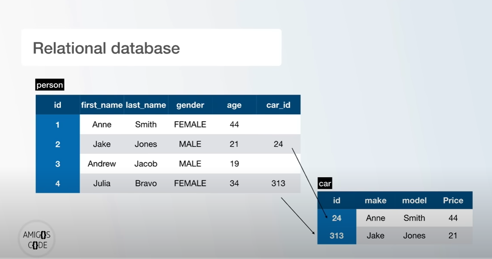

# Learn PostgreSQL

## Introduction

- PostgreSQL is one of the most popular databases out there.
- Robust
- Open-source
- High-performance
- Comes with a lot of features.
- Used for backend development.

We will not learn PostgreSQL by using some Graphical user Interface, which involves dragging and dropping an UI.

We need to understand how the actual logic works.

- We will use an interactive shell called <b>PSQL</b>.

- We will be using the Terminal or the Command Line to learn the raw commands behind everything we do.

- Postgres uses SQL as its main query language

We will learn:

- How to create Databases.
- How to Create Tables and insert them in the database.
- How to delete, update, and join tables together.
- etc.

## What is a Database?

A Database is a place where you can store, retrieve and manipulate data.

The data is usually stored in the computer server.

- Companies likes facebook store our data in a database.

## PostgreSQL and Relational Database.

- PostgreSQL is the actual database engine.
- SQL - Structured Query Language.
- SQL allows us to work/interact with databases.

SQL is a programming Language that allows us to have commands like this:

> <b>SELECT</b> first_name <b>FROM</b> person

`SELECT` is the actual command, the we have to specify some columns which is `first_name`.

`FROM` is also a reserved keyword for SQL, then the actual table name, `person`.

- SQL help us manage data in a relational database.
- Relational database is a relation between one or more tables.
- Easy to learn.
- Very Powerful.
- Used all over the internet.
- Data is stored in tables (columns and rows).

lets say we have a table called person.

> Table - person

The attributes of the `person` are as a column. Eg. `id, first_name, last_name, gender, age`

The rows is the actual data inside of that table.

Relational Database - simply a relationship between one or more tables.

## What is PostgreSQL?

### PostgreSQL is an object-relational database management system.

### Postgres installation on Windows.

<a href="https://www.enterprisedb.com/downloads/postgres-postgresql-downloads">PostgreSQL Installer</a>

After installing, click on windows icon, search for `p` postgres, inside the folder, drag `SQLShell (psql)` and the `pg admin4` and put them on the desktop.
