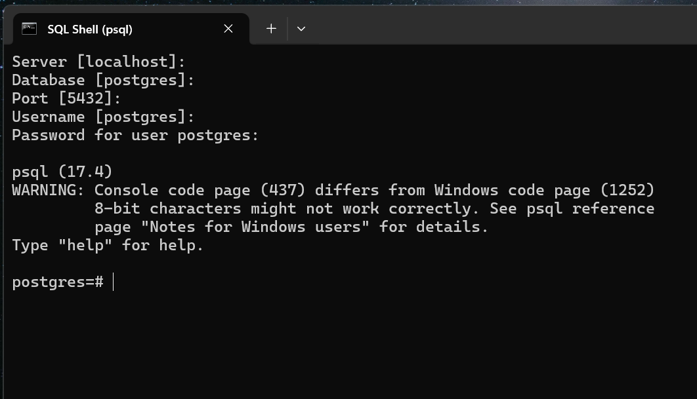

# GUI Clients vs Terminal/CMD Clients

When we have our database up and running, we need a way to connect to it.

Remember, our computer is serving as a computer server. `i.e. A database server` and anyone can connect to it to view content and perform all the operations supported by the database.

Ways of Connecting to the DataBase:

## 1. GUI Client

- An application that eases the way that you connect to the database.
- Makes it easy in performing inserts in the database, delete, view data and have the fancy UI elements.
   
   
- They include:

1.  DataGrip
2.  Postico - mac
3.  pgAdmin - windows

## How to Use PG Admin to connect to the local database.

- Click on PG Admin icon.
  On top right, there is Servers, open it up and inside you will see `postgresql`, click on it.

- Enter your password when prompted.

- Press OK and now you are connected.

- When you click database, you will see postgres.

 

## 2. Terminal or Command Line

- preferred choice by using commands to manipulate the database.
- Best way to get your hands dirty.

Example:

- SQL Shell (PSQL)

# Application

- Where you write a server side application, where you connect your database and then you can perform data, then return that data to your clients so that the client can make the data look nice on a screen or a mobile application.

#### We will focus on using Terminal to master Database.

- If you need to `Secure Shell` (SSH) into a remote server, then you will be comfortable using the terminal or cmd because will will not have any GUI client.

- Using SSH (Secure Shell) to interact with a database allows for secure and efficient management, enabling tasks like database import/export, command execution, and script running, all through a secure encrypted connection.

## PSQL setup on Windows

- click on PSQL shortcut.

I will prompt you to enter a server. If you were to connect to a remote server, that is where you would put the url.

- Since we are testing locally, we will connect to our local server.

Press `Enter` to accept the default.
By default, postgres ships with a server called postgres.

- Default post is `5432` and username is `postgres`, press enter to accept default.

- Use the password you entered during configuration.

`Password will not be shown as you type it`

- Connected. - That is how we connect to our local database.

