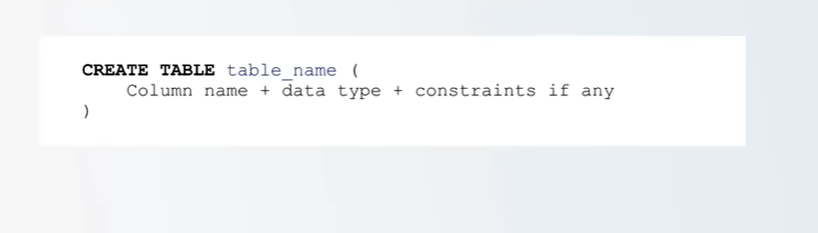
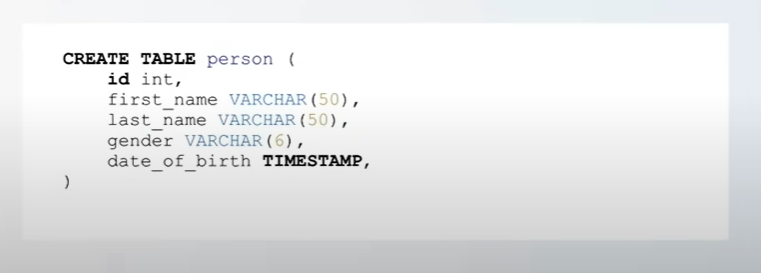
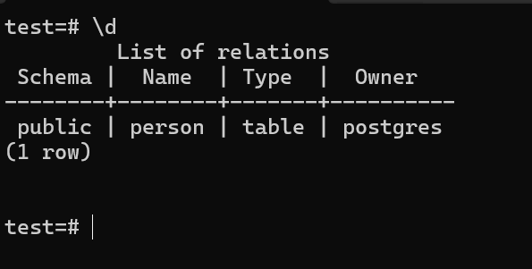
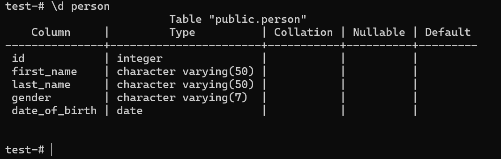
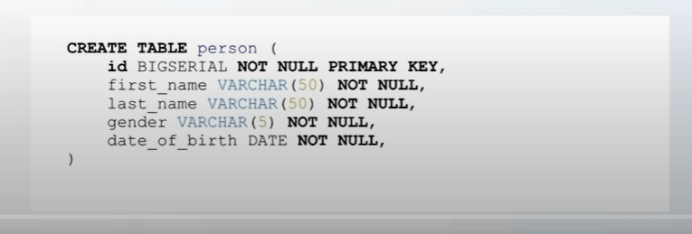
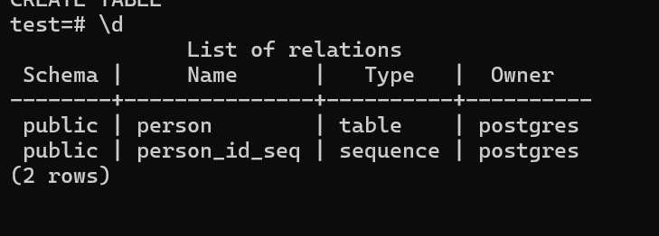
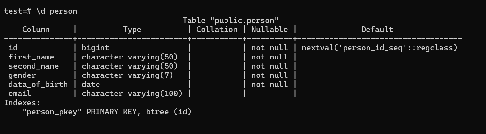

# How to Create Table with Postgres

We use the command: `CREATE TABLE` then the `table_name`, then `()`. Inside parenthesis you can have as many columns as you want.



- The columns have few attributes.

1. Column Name

2. Data Type - for that column name.

- If you have any constraints, you should also specify them. This is what it means:

Lets say you want to represent people in your database, so you will have a table like this:



- So we have a table called person.
- Inside we define the actual columns that this table should have.
- The first one is `id` with a datatype of `int`. (Integer meaning it is a number).
- 2. `first_name`, data type `VARCHAR`(Characters). The (50), means the maximum length the `first_name` column can have.

> Same for last name and gender.

- 3. `date_of_birth` with a data type `TIMESTAMP`. Timestamp includes the full date including hours, minutes and seconds.

- We can use a `DATE` instead of `TIMESTAMP`.

## Data Types in Postgres

<a href="https://www.postgresql.org/docs/current/datatype.html">Postgres Data Types Documentation</a>

# Creating Tables without Constraints

Lets connect to our database called `test` and create our first table.

> \c test

To clear the screen command: `\! cls`.

If you're stuck in query mode `test(#)`, press `Ctrl + C` to cancel the current query. It should bring you back to the `test=#` prompt.

- Lets create our first table using: `CREATE TABLE`, the name of the table, then the actual columns.

```
test-# CREATE TABLE person (
test(# id INT,
test(# first_name VARCHAR(50),
test(# last_name VARCHAR(50),
test(# gender VARCHAR(6),
test(# date_of_birth DATE);
```

Execute the command by pressing `Enter`. You will see that we have a table.

> CREATE TABLE

- To see the list of all tables in our database, we use the command:

> \d

d- describe



You will see we have a table called person of type table.

- We can go further and describe the actual table name.

> \d person



You will see the table, column attributes and their data types and some extra info (collation, nullable, Defaults). They are like constraints.

# Creating Tables with Constraints

We can specify some extra constraints in our table creation, to enforce that before a person enters a new record in the table, it must satisfy these constraints.

For instance, in our table `person` we can go ahead and create a person without an id or first_name etc.

There is no point of having a person without having any of that information.

To improve on that, we need to specify the actual constraint.



In the table above, you will see:

1. The `id` now becomes, `BIGSERIAL` (BIGSERIALS are integers that do increment by themselves).

- `NOT NULL` means that column must not be null.
- It is also specifying that the `id` is the `PRIMARY KEY` for this table.

- `id` uniquely identifies a person in the actual table.
- The same for others, `NOT NULL` means you must specify.

So now, we want to improve our table.

The same way we can drop a database, we can also drop tables. `Be careful when performing the operation.

Lets `DROP` the table, since it has no data in it.

> DROP TABLE person;

It will delete the table.

If you run the command `\d`. You will see that it will not find any relations.

```
test=# \d
Did not find any relations.
```

Lets go ahead and improve on the actual table creation.

```sql
test-# CREATE TABLE person (
test(# id BIGSERIAL NOT NULL PRIMARY KEY,
test(# first_name VARCHAR(50) NOT NULL,
test(# second_name VARCHAR(50) NOT NULL,
test(# gender VARCHAR(7) NOT NULL,
test(# date_of_birth DATE NOT NULL,
test(# email VARCHAR(100) );
```

When we press ENTER you will see,

> CREATE TABLE

Which means the table has been created. When we press `\d`

We will see:



To see tables only use:

> \dt

The reason we have the `person_id_seq` is because of the `BIGSERIAL` that we created. Its an auto eight-byte increment number.

> \d person

Our table:


