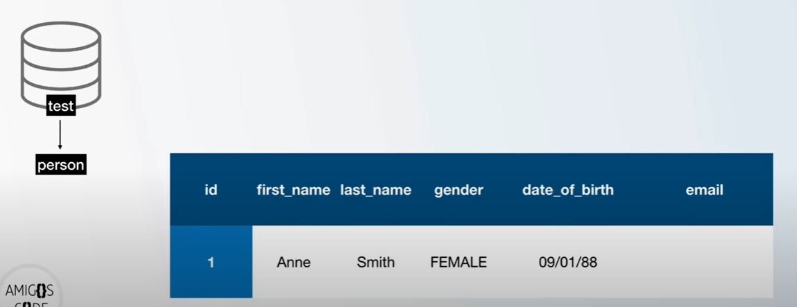
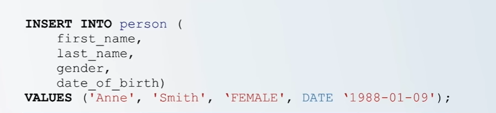
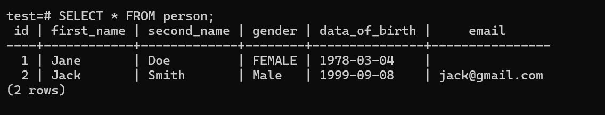

# How to Insert Records Into Tables



We currently have a database called test, with a table called person.

The table has a column of `id, first_name, gender, data_of_birth and email.`

Lets say we want to insert a new person into this table.

- The person will have an ID of 1, names: Anne Smith, a date of birth but no email.



- We use the Command:

> INSERT INTO actual_table_name

> INSERT INTO person

Then specify the columns that we want to insert.

Since the person does not have an `email`, we dont have to specify the email column.

Then we have to say: `VALUES`.

- Values takes a list of values matching the column data-types.
- In date, year comes first, then month then day.

That is how we insert records into a table.

When we want to insert the second person, it is still the same process.

If the person has an email, we also specify the email.

- Note that we are not specifying the `id` column. `BIGSERIAL` data type does an auto increment for us.

Lets do it practically:

```
test=# INSERT INTO person (first_name, second_name, gender, data_of_birth)

test-# VALUES('Jane', 'Doe', 'FEMALE', date '1978-3-4');

INSERT 0 1
```

To view the inserted data, use:

> SELECT \* FROM actual_table_name;

> SELECT \* FROM person;



# Generate 1000 Rows with Mockaroo

- Lets add 1000 more people in our table.
- Lets also add a column called `country of birth`.
- In order to add 1000 people in our table, we are going to use a website called `Mockaroo`. It generates data in various formats.

<a href="https://mockaroo.com/">Mockaroo Website</a>

- For our table, the ID is auto generated, so we will press `X` to exclude it.

- Go ahead and add another field, `date_of_birth`. On the type, search for `DATE`. Set the format.

- At email, put 30% meaning 30% of people will not have an email, 70% will have.
- Add another field: `country_of_birth`. Then Type: country.

- Basically, you will see we can generate 1000 rows, you can download 1000 each time, or sign up to set more rows.

- Change the format to `SQL`. The actual table name: `person`. Include the create table.

- Press Preview, you will see data that contains a list of random people. WHEN you press SQL, you will see a bunch of inserts.
- Press `Download` to download the data.

- To open the .SQL file, use VS code.

Add `NOT NULL` where necessary.

Use `\i file_path` command in sql shell.

- Open the CMD. cd to where you saved your file: `cd Downloads dir` . dir - see the list of file and folders in downloads directory.
- You will see your saved file: `person.sql`

- Now to get the actual path, write `cd` without any without any argument in windows.

- Copy it, go back to SQL shell, and paste the file destination starting with a `\i`. The \, then the name of the .sql file.

> \i C:\Users\Muraya Francis\Desktop\psql-scripts\person.sql

The above might not work in a windows, use this instead: (Instead of back slash \, use forward slash / ), then enclose the path in a single colon.

> \i 'C:/Users/Muraya Francis/Desktop/psql-scripts/person.sql'

PostgreSQL works better with forward slashes on Windows.

After pressing Enter, we will get error : `the country of relation person does not exist`.

So we need to DROP the table, all data will be deleted.

> DROP TABLE person;

Clear the screen, press up a couple of times to find and execute our command.

> \i 'C:/Users/Muraya Francis/Desktop/psql-scripts/person.sql'

If it does not run check for issues in the psql file.

To view the table:

> SELECT \* FROM person;

We forgot one thing, that is the id.
In our sql file, lets fix that:

> id BIGSERIAL NOT NULL PRIMARY KEY,

Use `q` to be able to use the commands beneath the generated table.

DROP the table again and import it again.
