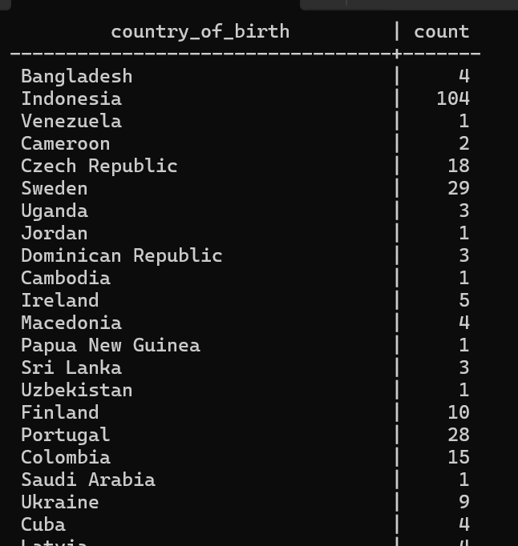
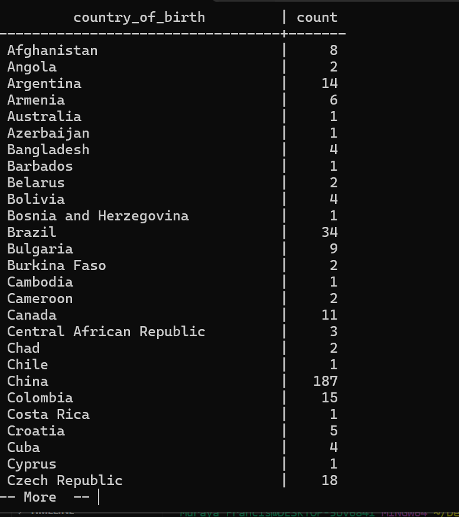

# GROUP BY

- Group data based on a column.

Lets say we want to find out how many people we have for each country that we have.
 
 To see all countries that we have:


 ```SQL
 SELECT DISTINCT country_of_birth FROM person;
 ```

 - You will view all countries that we have in our table.

 Lets find out how many people we have for each of this countries:

 ## GROUP BY

 ```sql
 SELECT column_name FROM table_name GROUP BY column_name;
 ```

 <br />

 ```sql
 SELECT country_of_birth FROM person GROUP BY country_of_birth;
 ```

 When we run this, it wont actually show the number of people in each country. 

 - This is because we have to select a second column.

 - The column is a function called `COUNT(*)`

 ```SQL
 SELECT country_of_birth, COUNT(*) FROM person GROUP BY country_of_birth;
 ```

 - it counts everyone from the country_of_birth and on the actual country_of_birth. 

 

  You can also apply order.

  ```sql
  SELECT country_of_birth, COUNT(*) FROM person GROUP BY country_of_birth ORDER BY country_of_birth;
  ```

  

  