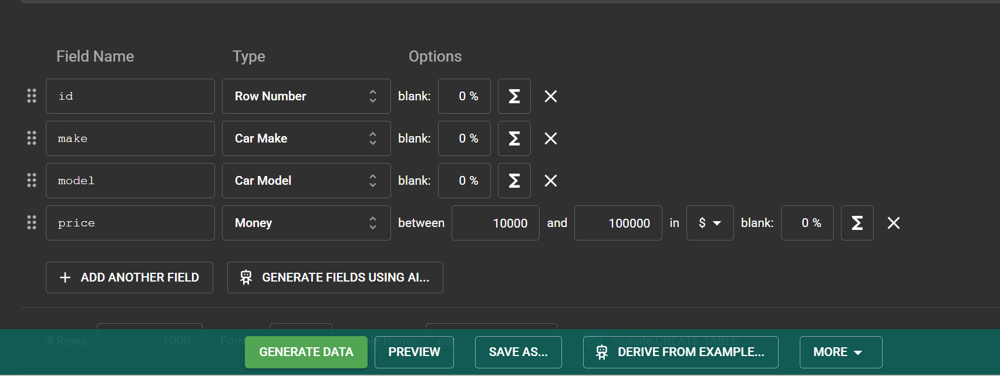
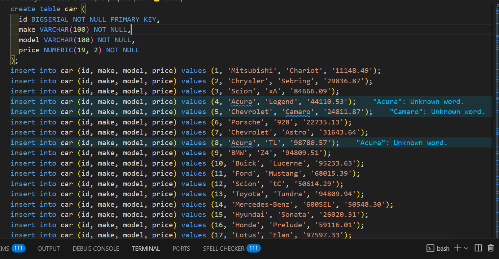

# Adding New Table and Data Using Mockaroo

Important aggregate functions that we will use:

- sum
- min
- max

Lets go to Mockaroo and generate a new table. 



Go ahead, download or generate data.

- You can adjust the price to be within a sensible range. 

```sql
\i 'C:/Users/Muraya Francis/Desktop/psql-scripts/car.sql';
```


- psql does not recognize $ as a numeric value.
- It might lead into error. So in VS code, select all `$` and replace with nothing. 



- Add the necessary data types and constraints.

```sql
In the NUMERIC(19,2) data type:

19 → The total number of digits (precision) allowed, including both sides of the decimal point.
2 → The number of decimal places (scale) after the decimal point.
```


> CRTL + H to find and replace

> In the box type `\$`

> Leave replace empty and press enter.

> ALT + ENTER to replace all.

> (The backslash \ before $ ensures it's treated as a literal character.)

import the table in our `test` database:

>  \i 'C:/Users/Muraya Francis/Desktop/psql-scripts/car.sql'

> IMPORT * FROM car;


