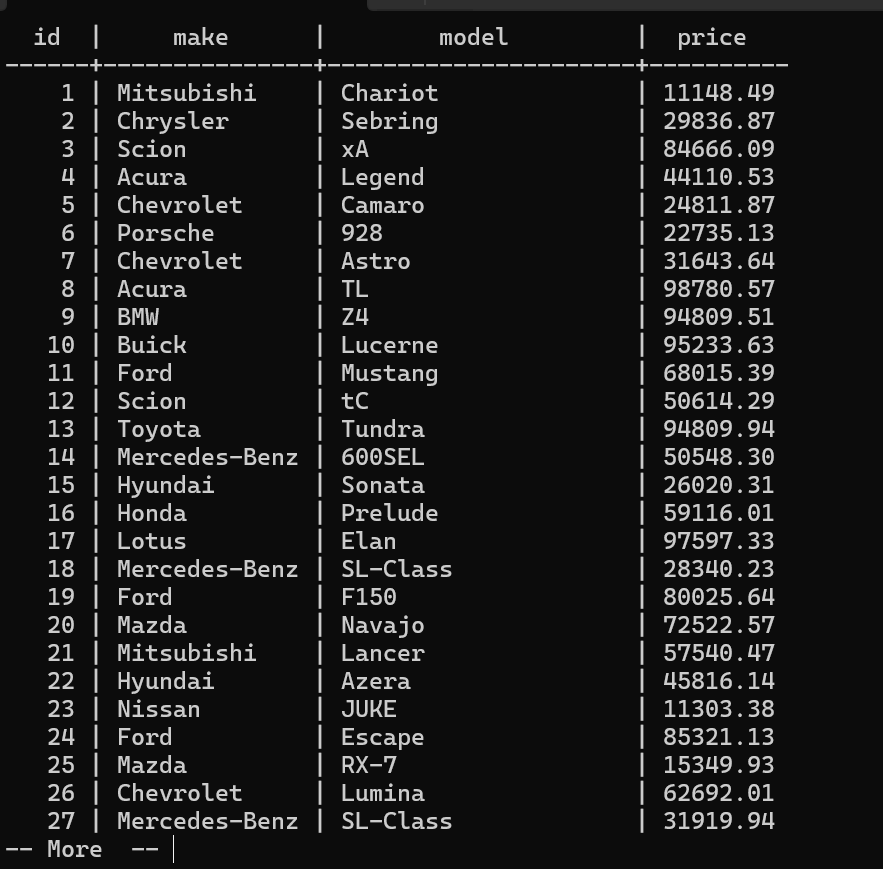

# Calculating Min, Max and Average

Lets find the most expensive car that we have in this table.


To perform that we use:

## Max Operation MAX()

> SELECT MAX(price) FROM car;

## MIN()

> SELECT MIN(price) FROM car;

We can also get the average of all car prices.

## AVG()

> SELECT AVG(price) FROM car;

We can also round the actual price (min, max or avg);

## ROUND()

> test=# SELECT ROUND(AVG(price)) FROM car;


We can group the information, like see the minimum price for each car `make`.

```sql
SELECT make, model, MIN(price) FROM car GROUP BY make, model;
```

We will see the minimum price for each `make` and `model`.

- Max price 

```sql
SELECT make, model, MAX(price) FROM car GROUP BY make, model;
```

- We can also drop the model;

```sql 
SELECT model, MAX(price) FROM car GROUP BY model;
```

We can also view the average using `AVG()`.


