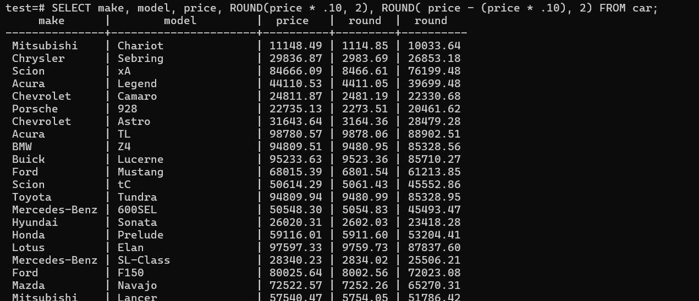
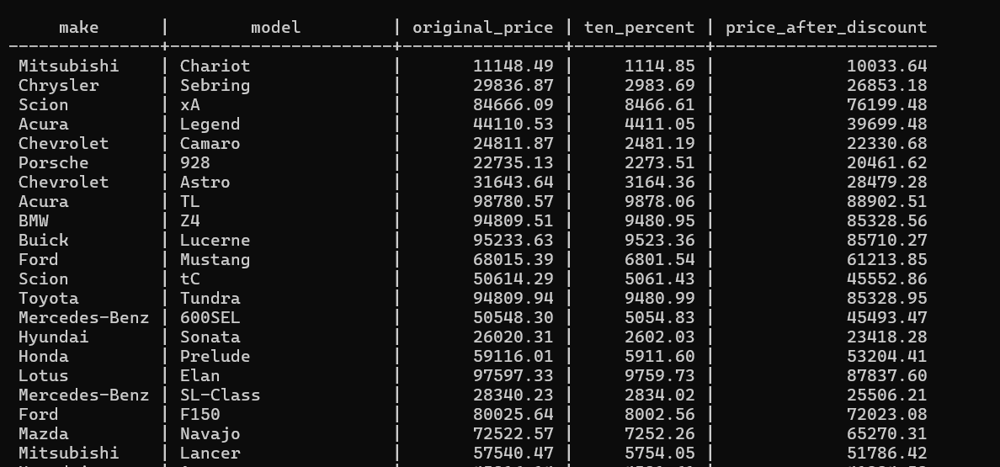

# Alias AS

On the discount price and price after discounted price we generated, the names of the columns are round and round which is not a good way to name our columns.



In postgres, if you don,t specify the column name, it uses the round function as the name or give you the column question marks.

- Use the `ALIAS` key word to provide names for the columns.

- `ALIAS` keyword can also override any column. 

## AS
 

 ```sql
  SELECT make, model, price AS original_price, ROUND(price * .10, 2) AS ten_percent, ROUND( price - (price * .10), 2) AS price_after_discount FROM car;
  ```


  

  - It good to avoid using % and other special characters in aliases which might lead to syntax error.

  

