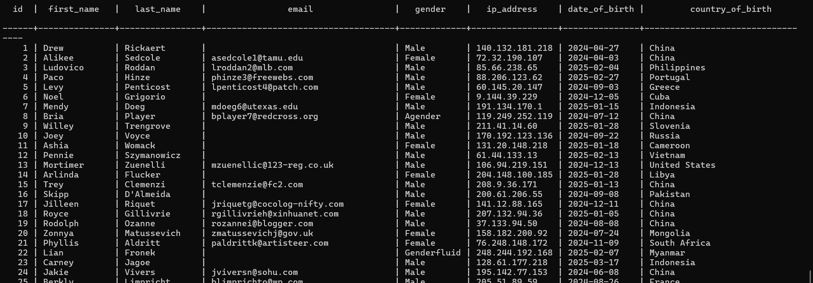
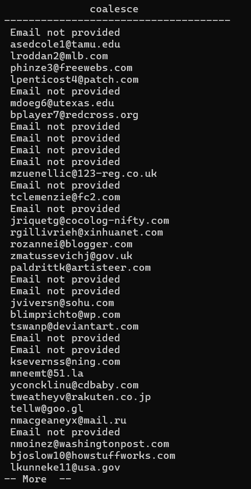

# Coalesce

Lets learn how to handle nulls with postgres.

## COALESCE()

`Coalesce` keyword allows us to have a default value incase the first one is not present.


```sql
SELECT COALESCE(1);
```

You will see we will have a result which is 1.

Lets go ahead and add an Alias;

```sql
SELECT COALESCE(1) AS number;
```


When the first parameter for this function is null, it will give us the second value by default.

```sql
SELECT COALESCE(null, 1) As number;
```
It will give a result of 1 still.

We can also have multiple values.

- If the first value is not present, it will try the second one, of not present it will try the third one and so on. 

```sql
SELECT COALESCE(null, null, null, 1) As number;
```
- We will still get 1. 

`COALESCE` finds the very first value, if I have 1 and then 10, it will result in 1.

```sql
test=# SELECT COALESCE(null, null, null, 1, 10) As number;
```
The above will result in 1 still.


Lets use `COALESCE() with our dataset. 

- Lets view our table named person.

```sql
SELECT * FROM person;
```

You will see that we have a bunch of emails.



- But also we have people without emails. 


- Lets say we want to select every email, and for the people who do not have an email, we need to have a value of `email not provided`. 

We need to select email from person. 

```sql
 SELECT email FROM person;
 ```

 We will know only have emails.

 Lets bring in our `COALESCE()`.

 - Inside our `COALESCE()  will have email`.

 ```SQL
 SELECT COALESCE(email) FROM person;
 ```

 When we press ENTER, nothing changes. 

 We can go ahead and specify the default value in single quotes when the email is not available. 

 ```sql
  SELECT COALESCE(email, 'Email not provided') FROM person;
  ```

  

  - You will see email not provided as default in people who had not emails.

  - Scroll down to see alot more.

  Coalesce is powerful where we have columns with no values and we want then to have a default value.
  


